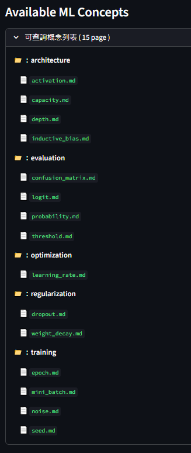
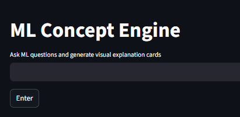
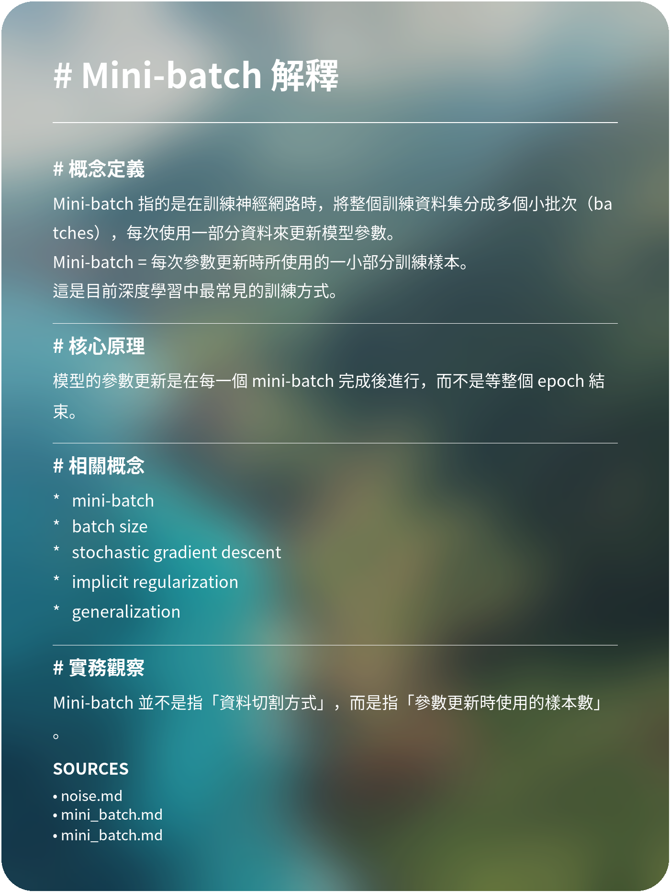

# ML Concept Engine
Article: [Read on Medium](https://medium.com/@fengyun3999/你真的記得你寫過的筆記嗎-593f8f200b18)

一個基於 **LLM + RAG** 的知識庫系統，  
可以將技術概念自動轉換成 **結構化說明與視覺知識卡片**。

🔗 Live Demo  
https://ml-concept-engine.streamlit.app/

---

## 專案介紹

ML Concept Engine 是一個 AI 輔助知識系統，  
透過 **Retrieval Augmented Generation (RAG)**  
從整理好的知識庫中檢索內容，  
並使用 LLM 生成結構化技術解釋。

系統會自動產生：

- 內容概念說明
- 檢索到的知識來源
- 視覺化知識卡片

使用者只需輸入問題，例如：

- capacity 與 depth 的關係？
- learning rate 是什麼
- dropout 的作用
- activation function
- model capacity
- attention mechanism

系統就會生成完整的技術說明與知識卡片。 

(以上為本專案整理內容，內容可由使用者自訂義)

---

## Demo展示

### Knowledge Base (RAG Source)

系統會從整理好的知識庫中檢索概念內容。



資料夾的目的在於提升可讀性與維護性，

而非作為檢索依據，因此不需過度設計分類層級。

## 使用者資料夾結構設置

```text
knowledge/
└── 主題（domain）
    └── 概念分類（category）
        └── 概念文件（.md）
```

---

### Web Interface

使用者可以輸入問題。



---

### Generated Knowledge Card

系統會生成結構化知識卡片。



---

## 使用提示

將 Markdown 文件放入：

```text
knowledge/
```

系統會自動：

- 掃描所有 .md
- 切分為語意片段（chunks）
- 建立向量表示（embedding）

使用者輸入問題後：

- 系統從知識庫中找出最相關內容
- 組合後交由 LLM 生成回答

### 設計原則

- 不依賴資料夾或檔名
- 檢索完全基於內容語意
- 新增資料不需修改程式

### 優點

- 使用門檻低（放檔案即可用）
- 可自由擴展知識內容
- 適合跨領域學習與整理

### 目前限制

- 資料多時可能檢索不精準
- 檢索範圍不可控（無分類過濾）

### 注意事項

- context 過多時會增加 token 成本
- 使用者資料夾結構影響 可查詢表格 UI 呈現方式

---
## 問題定義

LLM 雖然可以快速回答問題，但這些答案通常是一次性的，缺乏可累積與可檢索的結構。

當學習內容增加時，使用者容易反覆詢問相似問題，導致知識無法沉澱。

本系統的設計目標，是將這些零散內容轉換為可檢索的知識單位，

讓查詢行為從重新詢問轉變為記憶檢索。

---

### 為什麼要做 Retrieval ?

原本做法：把整份 Markdown 作為 context 丟給 LLM

問題：

- 單次請求 token 成本過高 當時15page 使用量達 **18k+**
- context 過長導致回答品質下降
- irrelevant noise 影響結果

```text
我把資料篩選交給模型處理，
而不是在系統層先決定什麼是重要的!
```
### 為了解決成本過高與品質下降問題做了那些調整?

我改為：chunk + embedding + top-k retrieval

- 使用 `##` 將 Markdown 切分為語意段落
- 使用 sentence-transformers 建立向量
- 使用 cosine similarity 做相似度排序
- 僅取 top-k chunk 作為 context 目的減少 token 成本與降低 noise

```text
token 使用量從 18K+ 降至 1~2K
回答更聚焦（減少 irrelevant noise）
系統可控性提升（可調整 chunk / top-k）
```
---

## 系統流程

```text
使用者輸入問題
    ↓
Streamlit Web App
    ↓
RAG Retrieval (Knowledge Base)
    ↓
Gemini LLM Generation
    ↓
PIL Generate Knowledge Card
    ↓
Upload Image to Cloudinary
    ↓
Save Card Metadata to Supabase
    ↓
Return Result to Frontend
```

---

## 系統功能

### 知識庫概念問答

使用 LLM 生成技術說明。

---

### RAG 知識檢索

系統會從整理好的 ML Markdown 知識庫中  
檢索最相關的概念內容。

---

### 自動生成知識卡片

系統會生成可視化卡片，包含：

- 概念定義
- 核心原理
- 實務觀察
- 相關概念
- 來源文件

---

### 卡片歷史紀錄

每張生成的知識卡片會：

- 上傳至 Cloudinary
- 紀錄於 Supabase

可追蹤生成歷史。

---

# 技術架構

### 前端

- Streamlit

### AI / NLP

- Gemini API
- sentence-transformers

### 後端

- Python

### 雲端服務

- Cloudinary（圖片儲存）
- Supabase（資料庫）

### 部署

- Streamlit Community Cloud

---

# 專案結構


#結構說明

| Folder | Description |
|------|------|
| assets | 背景圖、字體與視覺資源 |
| knowledge/ml | 機器學習概念知識庫（Markdown）持續更新中 |
| src/app | Streamlit Web App 入口 |
| src/core | 核心邏輯（LLM、Cloudinary、Supabase） |
| src/retrieval | RAG 檢索模組 |

---

# 作者

Neurons-33
